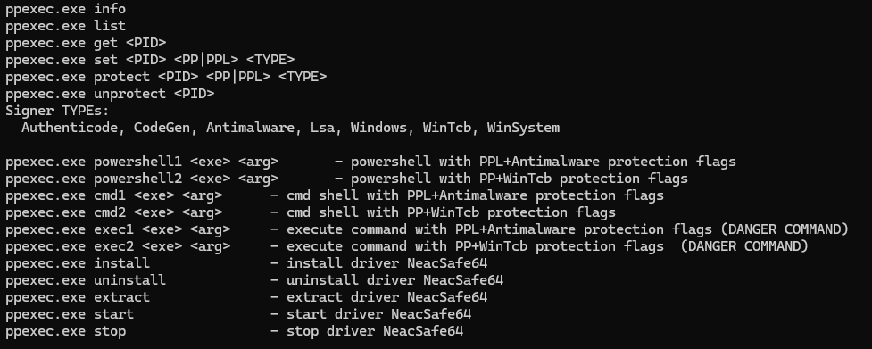

# PPLControlShells — Protected Process / PPL Control Tool (x64 only)



Overview
--------
`ppexec` is a native Windows utility for experimenting with and managing Protected Process (PP) and Protected Process Light (PPL) protections on modern Windows (Windows 10/11 and compatible Server builds). It is intended for defensive research, compatibility testing of security products (AV/EDR), and demonstrations of process protection behaviors.

Important safety notice
-----------------------
This project uses a vulnerable kernel driver (e.g., `NeacSafe64`) to obtain privileged kernel read/write capabilities required to change process protection attributes. These capabilities are powerful and dangerous and can destabilize or compromise a system. Use `ppexec` only in isolated, disposable lab environments (VM snapshots). Do not run on production systems.

High-level purpose
------------------
- Create processes with PP/PPL protection flags (for example, spawn `powershell` or `cmd` and mark them PPL+Antimalware or PP+WinTcb).
- Protect and unprotect arbitrary processes by PID.
- Query a process protection state.
- Install, start, stop and uninstall the helper driver used to perform kernel-level operations.
- Provide CLI-driven workflow for automated testing and research.

Features
--------
- Install, extract and control the bundled helper driver artifacts (INF/SYS).
- Use the driver to discover kernel offsets and modify kernel structures to set protection fields.
- Launch interactive shells (PowerShell / cmd) and apply protection flags to them.
- Create suspended processes, set protection, then resume them (apply protection before untrusted code executes).
- List protected processes and get protection info for a single process.
- Logging used for diagnostics with multiple log levels.

Architecture
------------
- Language: native C++ (MSVC, C++20 allowed).
- Single-console executable: `ppexec.exe`.
- Modular components:
  - `Controller` — driver communication and protection logic.
  - `RTCore`, `OffsetFinder` — runtime helpers to discover kernel offsets for target OS build.
  - `service` — service/driver install & control utilities.
  - `extract` — extract embedded driver resource files.
  - `cmd`, `pids`, `files` — process creation, PID watcher, pipe capture helpers.
  - `dynapi` — dynamic Windows API binding at runtime.
  - `bcrypt`/`crypt` — subproject providing a file-encryption demo.
  - Logging wrapper (`g_log`) and other helper utilities.
- Runtime model:
  - CLI validates environment (admin rights, service presence).
  - If driver present and running, the Controller uses it to perform kernel reads/writes required to change process protection.
  - Process creation helpers support interactive shells and suspended execution flows.

Subproject: `bcrypt` (filecrypt)
--------------------------------
- Demonstration tool implementing authenticated symmetric file encryption using CryptoAPI.
- Algorithms and format:
  - AES-256-CBC for encryption.
  - HMAC-SHA256 for authentication.
  - KDF: SHA256(pass || salt || purpose) to derive ENC and MAC keys (demo only).
  - File layout: header (magic/version/salt/iv/original size) + ciphertext + 32-byte HMAC tag.
- CLI:
  - `bcrypt.exe --enc <path>` — produce `<name>_crypted<ext>`.
  - `bcrypt.exe --dec <path>` — decrypt and write original or `_decrypted` file.
- Security note: demo uses a hardcoded passphrase — replace with secure input and a proper KDF (PBKDF2/Argon2) for real use.

Build requirements
------------------
- Windows 10 / Windows 11 development environment.
- Visual Studio 2022 recommended (MSVC toolset).
- Linked libraries referenced in source: `advapi32.lib`, `fltlib.lib`, `bcrypt.lib`, `Newdev.lib`.
- Many operations require Administrator privileges (driver install/start and kernel operations).

Build examples
--------------
- Build the `bcrypt` demo with the Microsoft compiler:
- Use the provided Visual Studio project/solution to build the full `ppexec` executable (match target architecture: x64 recommended).

CLI usage
---------
General pattern:
````````

Supported commands:
- `info` — print system/process info and parent process info.
- `list` — list protected processes.
- `get <PID>` — get protection info for a specific process.
- `set <PID> <PP|PPL> <TYPE>` — set protection attributes for given process (low-level).
- `protect <PID> <PP|PPL> <TYPE>` — helper to protect process.
- `unprotect <PID>` — remove protection from a process.
- `powershell1 <exe> <arg>` — spawn PowerShell with PPL + Antimalware flags.
- `powershell2 <exe> <arg>` — spawn PowerShell with PP + WinTcb flags.
- `cmd1 <exe> <arg>` — spawn cmd with PPL + Antimalware.
- `cmd2 <exe> <arg>` — spawn cmd with PP + WinTcb.
- `exec1 <exe> <arg>` — execute a single command with PPL+Antimalware (dangerous).
- `exec2 <exe> <arg>` — execute a single command with PP+WinTcb (dangerous).
- `install` — extract and install the driver (requires admin).
- `uninstall` — stop and remove driver and artifacts.
- `extract` — extract driver INF/SYS from embedded resources.
- `start` — start driver service.
- `stop` — stop driver service.

Examples
--------
- Install driver (Administrator required):
````````
- Start service:
````````
- Launch protected interactive PowerShell (PPL + Antimalware):
````````
- Protect an existing process:
````````

Operational and security warnings
---------------------------------
- This tool depends on a vulnerable driver that exposes arbitrary kernel R/W. Possession or usage of such a driver may violate policies or laws. Only use for legitimate research in controlled lab environments.
- Modifying kernel memory can cause BSODs. Ensure you understand and validate offsets and data structures for the exact OS build and architecture before applying changes.
- Always test on VM snapshots and maintain backups.
- Avoid running this on production or sensitive machines.

Troubleshooting
---------------
- If the driver/service does not exist: run `ppexec.exe install` then `ppexec.exe start`.
- If commands fail due to privileges, rerun as Administrator.
- If offsets cannot be found: `OffsetFinder` may need updates for your OS build; verify supported builds and update patterns.

Contributing
------------
- Follow repository `.editorconfig` and `CONTRIBUTING.md`.
- Document new kernel offsets, OS-specific differences, and test coverage.
- Keep changes small, well-documented and tested on supported OS builds.

License
-------
- Add an appropriate license before public distribution. The repository currently does not specify a license; choose one that fits your intended usage and compliance requirements.

Further work
------------
- Add a simulation/safe mode that does not perform kernel writes (useful for demos).
- Hardening and replacement of the `bcrypt` demo with CNG / BCrypt and a proper KDF.
- Split risky operations into a library + restricted service with explicit checks and safer APIs.
